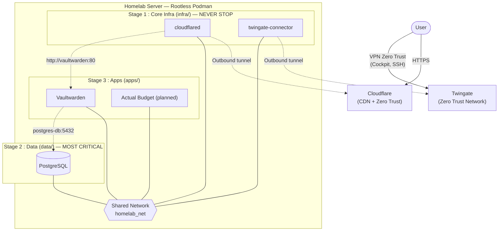

# Homelab Architecture — Overview

Current production stack: rootless Podman, 3 tiers (`infra/` → `data/` → `apps/`), shared network `homelab_net`, Zero Trust posture (no inbound ports, outbound tunnels only).

## Principles

- **Zero inbound ports**: all traffic goes through encrypted outbound tunnels (Cloudflare Tunnel, Twingate).
- **Rootless Podman**: no root privileges for containers.
- **Isolated secrets**: each tier has its own `.env` (never versioned).
- **Pinned versions**: images are frozen in the orchestration files; specific versions are not exposed in public diagrams.
- **Mandatory deployment order**: `infra` → `data` → `apps`.

> **Migration in progress**: the `podman-compose` orchestration is evolving towards Quadlet (user systemd units) — see [quadlet-migration-plan.md](quadlet-migration-plan.md).
