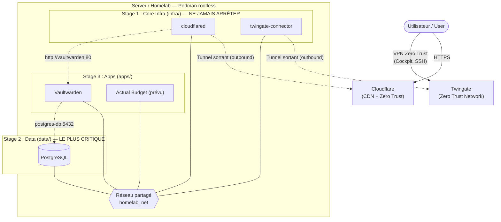

# Architecture Homelab — Vue d'ensemble

Stack de production actuelle : Podman rootless, 3 niveaux (`infra/` → `data/` → `apps/`), réseau partagé `homelab_net`, posture Zero Trust (aucun port entrant, tunnels sortants uniquement).

## Principes

- **Zéro port entrant** : tout le trafic passe par des tunnels sortants chiffrés (Cloudflare Tunnel, Twingate).
- **Rootless Podman** : aucun privilège root pour les conteneurs.
- **Secrets isolés** : chaque niveau possède son propre `.env` (jamais versionné).
- **Versions épinglées** : les images sont figées dans les fichiers d'orchestration ; les versions précises ne sont pas exposées dans les diagrammes publics.
- **Ordre de déploiement obligatoire** : `infra` → `data` → `apps`.

> **Migration en cours** : l'orchestration `podman-compose` évolue vers Quadlet (unités systemd utilisateur) — voir [quadlet-migration-plan.md](quadlet-migration-plan.md).
