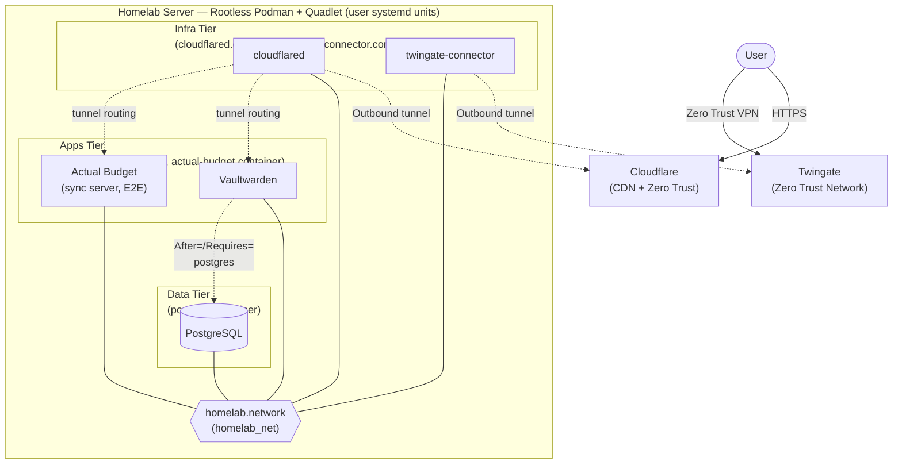
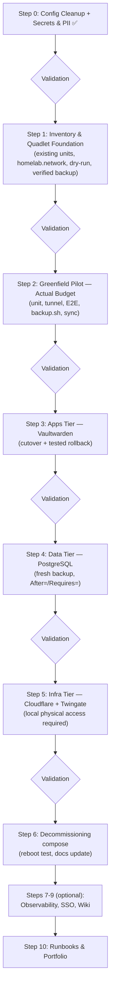

# Migration Plan: Podman Compose → Quadlet (systemd)

## Context and Architectural Decision

The production stack of the homelab server (rootless Podman, 3 tiers: `infra/` → `data/` → `apps/`) **remains in place**: no migration to Kubernetes is performed on this server. Decision motivated by:

- **Security**: the current rootless posture is stricter at the node level than that of a kubeadm/CRI-O cluster (rootful runtime). It is kept in its entirety.
- **Hardware Sobriety**: the server has a modest CPU (2 cores / 4 threads) and hosts critical services 24/7. A permanent Kubernetes control-plane would impose a disproportionate load.
- **Criticality**: Vaultwarden is the household's password manager — the risk of migrating the entire orchestrator outweighs the learning benefits.

The chosen evolution is migrating the orchestration **`podman-compose` → Quadlet** (Podman's native systemd units): same runtime, same images, same named volumes, same network — only the lifecycle manager changes.

> Kubernetes/OpenShift learning is done on separate personal hardware (disposable clusters, cloud sandbox) and is **out of scope for this repository and this server**.

## Why Quadlet?

- **Direction backed by the Red Hat ecosystem**: `podman-compose` is a community tool taking a back seat; Quadlet is the native integrated path in Podman for systemd deployments.
- **Complete systemd lifecycle**: startup at boot in the correct order (`After=`/`Requires=` dependencies between tiers), supervised restart, logging via `journalctl --user`.
- **Rootless unchanged**: Quadlet units run in user mode (`~/.config/containers/systemd/`), with `loginctl enable-linger` already in place.
- **IaC preserved**: `.container`/`.network` units are versioned text files in this repository (e.g., `apps/quadlet/`), deployed via `git pull` + copy to `~/.config/containers/systemd/` + `systemctl --user daemon-reload`. Secrets remain in unversioned `.env` files, consumed via `EnvironmentFile=`.
- **Transferable skills**: unit-file syntax and systemd management are cross-cutting skills (enterprise Linux servers, edge computing).

## Security Principles (unchanged, Security by Design / OWASP)

- **Rootless**: no system (root) units; everything remains in user units.
- **Zero inbound ports**: Zero Trust posture preserved (Cloudflare Tunnel / Twingate outbound only).
- **Secrets**: `.env` files only, never hardcoded values in a versioned file.
- **Pinned versions**: exact tags in `.container` units (never `latest`), without exposing versions in public diagrams.
- **No personal or identifying information** in versioned files (Secrets & PII rule in `.agents/rules/homelab-devops.md`).
- **Verified backup before any cutover** affecting PostgreSQL or application volumes.
- **Permanent rollback**: at each migration step, the old path (`podman-compose -f <stage>/compose.yml up -d`) remains functional until the full migration is validated.

## Strategy: greenfield pilot, then migration by increasing impact radius

1. **Pilot: Actual Budget (new service, zero risk)** — a brand-new service has no data and no users: ideal to learn the Quadlet workflow (writing units, `EnvironmentFile=`, network, tunnel routing, backup) without any downtime risk.
2. **`apps/` (Vaultwarden)** — documented as stoppable/restartable without dropping remote access.
3. **`data/` (PostgreSQL)** — brief downtime tolerated, after backup verification.
4. **`infra/` last** — the lifeline of remote access; cutover only with local physical access.

## Roadmap (step-by-step validation)

### Step 0 — Configuration Cleanup ✅
- [x] Redaction of real identifiers, generalized hardware/storage, Secrets & PII rule
- [x] Pinned versions (`apps/compose.yml`), fixed `.gitignore`
- [x] Commit and push everything (pending validation)

### Step 1 — Inventory and Quadlet Foundation ✅ (excluding dry-run, done in Step 2)
- [x] Inventory existing systemd/Quadlet units: no Quadlet units, only `podman-restart.service` is enabled (will be removed in Step 6 when Quadlet manages the lifecycle)
- [x] Verify `loginctl enable-linger` (active) and Podman version: Quadlet prerequisites satisfied (recent version, cgroups v2, generator present — exact versions not documented here, anti-fingerprinting rule)
- [x] Create the network unit `infra/quadlet/homelab.network` (Subnet/Gateway picked from existing network: `10.89.0.0/24` / `10.89.0.1`)
- [x] Validate unit syntax with `/usr/libexec/podman/quadlet -dryrun -user` — performed during deployment of Step 2, units generated correctly (network/volume dependencies automatically added by the generator)
- [x] Verify integrity of the latest backup — **incident detected and fixed, see Step 1 bis**

### Step 1 bis — Backup Incident (detected and resolved 2026-08-03) ✅
The inventory revealed that **no backup existed since the server reinstallation** (4 cumulative causes: wrong `BACKUP_DIR`, mount point permissions, prefixed podman-compose volume not handled by `backup.sh`, missing schedule). Fixes applied and verified, including a full test restoration (level 3).
Full details, 3-level verification procedure, and lessons learned: [`docs/runbooks/sauvegardes-verification-restauration.md`](runbooks/sauvegardes-verification-restauration.md).
- [x] `backup.sh` fixed (volume `apps_vaultwarden_data`) and synced to the repo
- [x] Daily schedule via user systemd timer — units versioned in `scripts/systemd/`
- [x] PostgreSQL test restore successful (database, tables, and users verified)

### Step 2 — Greenfield Pilot: Actual Budget (sync server)
- [x] Write `actual-budget.container` + `actual-budget.volume`: pinned image, volume `apps_actual_budget_data` (naming standard), shared network, resource limits
- [x] Deployment validated: dry-run OK, active service, successful internal HTTP test
- [x] Add Cloudflare Tunnel route to the service (same model as Vaultwarden: zero inbound ports, HTTPS everywhere)
- [x] Enable server password and **end-to-end encryption** for budget files (data remains encrypted at rest on the server side)
- [x] Extend `scripts/backup.sh` to the Actual Budget volume — verified, section [3/3] ✅
- [x] Verify sync from desktop app and mobile browser
- [x] Step runbook written: [`docs/runbooks/quadlet-pilote-actual-budget.md`](runbooks/quadlet-pilote-actual-budget.md) — template for subsequent migrations

### Step 3 — Migration: Apps Tier (Vaultwarden) ✅ (cutover on 2026-08-03)
- [x] Write `vaultwarden.container` + `vaultwarden.volume` (pinned image 1.37.0→1.37.1, per-service env, reused existing volume, resource limits)
- [x] Cutover performed: stop compose, start Quadlet, access verified (web, desktop, mobile) — downtime < 1 min
- [x] Rollback procedure documented in runbook (not exercised: cutover succeeded on the first try; compose path remains available until Step 6)
- [x] Runbook: [`docs/runbooks/quadlet-bascule-vaultwarden.md`](runbooks/quadlet-bascule-vaultwarden.md)
- [x] Post-cutover hardening: NOTICE "plain text ADMIN_TOKEN" resolved — cause: compose escaping (`$$`, quotes) copied literally into Quadlet env, read literally by `podman --env-file`; fixed without rotation (token never exposed), details in runbook

### Step 4 — Migration: Data Tier (PostgreSQL) ✅ (cutover on 2026-08-03, in two phases)
- [x] Fresh `pg_dumpall` backup + integrity check before cutover
- [x] Env file validated by `scripts/check-env.sh` before cutover
- [x] `postgres.container` + `postgres.volume` (compose volume reused, same pinned version, `pg_isready` healthcheck + `Notify=healthy`)
- [x] Phase A: compose → Quadlet cutover, data intact ("Skipping initialization"), healthy container, Vaultwarden connections verified
- [x] Systemd dependency `Requires=`/`After=postgres.service` on Vaultwarden — waits for a *ready* database (healthcheck), not just a launched container
- [x] Phase B: non-superuser `vaultwarden_app` role owns `vwarden_db` (tables and sequences transferred), `DATABASE_URL` migrated, restart validated
- [x] Runbook: [`docs/runbooks/quadlet-bascule-postgres.md`](runbooks/quadlet-bascule-postgres.md)
- [x] Healthcheck sanitized (Step 5): `-U $$POSTGRES_USER -d $$POSTGRES_DB` — zero FATALs, the probe now also checks the accessibility of the application database

### Step 5 — Migration: Infra Tier (Cloudflare + Twingate) ✅ (cutover on 2026-08-04)
- [x] Prerequisite met: cutover performed with local physical access available
- [x] `cloudflared.container` and `twingate-connector.container` (static IP preserved, per-service env with `TUNNEL_TOKEN` under its final name)
- [x] Cutover **one tunnel at a time** (Twingate then Cloudflare), remote access verified from an outside network: Zero Trust VPN and HTTPS operational
- [x] PostgreSQL healthcheck fix applied concurrently (zero FATALs)
- [x] Runbook: [`docs/runbooks/quadlet-bascule-infra.md`](runbooks/quadlet-bascule-infra.md)

**Service migration complete**: all five services now run under Quadlet units.

### Step 6 — Decommissioning podman-compose ✅ (2026-08-04)
- [x] `podman-restart.service` disabled (Quadlet now manages the lifecycle) and residual compose pods deleted
- [x] **Full reboot test successful**: all five services restart on their own at boot, in the correct order (PostgreSQL then Vaultwarden, waiting for healthcheck is visible in timestamps); backup timer is correctly rescheduled
- [x] README updated (Quadlet deployment replacing compose commands, in both languages)
- [x] `.agents/workflows/deploy-stage.md` rewritten as Quadlet workflow (validation, per-service secrets, dry-run, rollback, precautions)
- [x] Deprecation notice added at the top of the three `compose.yml`, kept as fallbacks
- [x] `scripts/backup.sh` verified after cutover — and hardened following the 2026-08-04 incident (silent failure, see backups runbook)

**Migration complete.** The following steps are optional additions, more evolutions than migrations.

### Step 7 — Lightweight Observability ✅ (2026-08-05)
- [x] Prometheus, Grafana, node_exporter, and a Podman exporter (chosen over cAdvisor, better suited for rootless) as Quadlet units with resource limits
- [x] Grafana accessible via VPN only; Prometheus not exposed
- [x] Data source and alert rules provisioned as code
- [x] Monitoring the backup itself via the textfile collector (lesson learned from 2026-08-03 and 08-04 incidents)
- [x] Host resources dashboard imported; Grafana volume included in backups, Prometheus volume deliberately excluded
- [x] Runbook: [`docs/runbooks/observabilite.md`](runbooks/observabilite.md)
- [x] Notification channel: self-hosted service exposed via the public tunnel (an alert channel dependent on the VPN would miss the moments when it's most useful), closed by default, separate write-only Grafana account on a single topic, token outside repo. Point of contact and routing policy provisioned; chain validated end-to-end to phone and browser.

### Step 8 — SSO (abandoned)
Decision on 2026-08-05: no application currently hosted (Vaultwarden, Actual Budget) supports federated authentication (OIDC/SAML) in a stable release. Deploying Keycloak or Authentik would mean tying up 500 MB to 1 GB of RAM just to cover Grafana alone. Re-evaluation possible if a future application supporting OIDC joins the stack.

### Step 9 — Automated Documentation Publishing (GitLab Pages) ✅
Decision on 2026-08-05: BookStack/Wiki.js abandoned in favor of GitLab Pages. All content to be published is already versioned project documentation — an additional self-hosted service (database, backup, updates) would unnecessarily duplicate what Git already provides, for content that doesn't need interactive editing from a browser.
- [x] `mkdocs.yml` (Material theme, rendering of Mermaid diagrams already used in `docs/`)
- [x] `.gitlab-ci.yml`: automated build and publish on every push to `main`, without consuming homelab server resources (execution on GitLab runners)
- [x] As the repo is also mirrored on GitHub, `.github/workflows/pages.yml` reproduces the same publishing (same `mkdocs.yml`/`docs/`, same `--strict` build) via GitHub Actions — one-time manual activation required: Settings > Pages > Source = "GitHub Actions"
- [x] Homepage (`docs/index.md`) — see Step 10, both tasks were merged

### Step 10 — Runbooks & Portfolio ✅
- [x] Consolidation of Steps 2-7 runbooks into a portfolio homepage (`docs/index.md`): approach, real incidents and resolutions, current state — without personal elements, published via GitLab Pages (Step 9)

## Target Architecture

Posture unchanged: rootless, zero inbound ports, secrets via `EnvironmentFile=` (unversioned `.env` files).

## Visual Roadmap

Each "Validation" is a breakpoint: no subsequent step without explicit approval.
