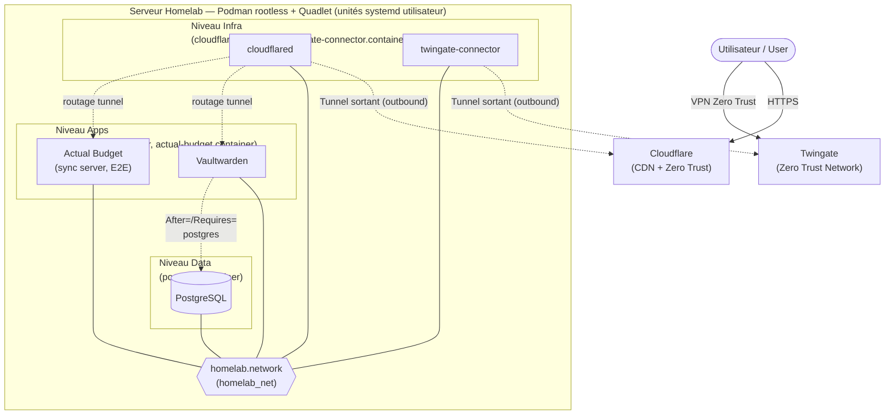
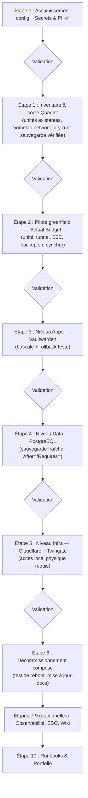

# Plan de Migration : Podman Compose → Quadlet (systemd)

## Contexte et décision d'architecture

La stack de production du serveur homelab (Podman rootless, 3 niveaux : `infra/` → `data/` → `apps/`) **reste en place** : aucune migration vers Kubernetes n'est effectuée sur ce serveur. Décision motivée par :

- **Sécurité** : la posture rootless actuelle est plus stricte au niveau du nœud que celle d'un cluster kubeadm/CRI-O (runtime rootful). Elle est conservée intégralement.
- **Sobriété matérielle** : le serveur dispose d'un CPU modeste (2 cœurs / 4 threads) et héberge des services critiques 24/7. Un control-plane Kubernetes permanent imposerait une charge disproportionnée.
- **Criticité** : Vaultwarden est le gestionnaire de mots de passe du foyer — le risque d'une migration d'orchestrateur complet dépasse son bénéfice d'apprentissage.

L'évolution retenue est la migration de l'orchestration **`podman-compose` → Quadlet** (unités systemd natives de Podman) : même runtime, mêmes images, mêmes volumes nommés, même réseau — seul le gestionnaire de cycle de vie change.

> L'apprentissage Kubernetes/OpenShift se fait sur du matériel personnel séparé (clusters jetables, bac à sable cloud) et est **hors du périmètre de ce dépôt et de ce serveur**.

## Pourquoi Quadlet ?

- **Direction soutenue par l'écosystème Red Hat** : `podman-compose` est un outil communautaire en retrait ; Quadlet est la voie native intégrée à Podman pour les déploiements systemd.
- **Cycle de vie systemd complet** : démarrage au boot dans le bon ordre (dépendances `After=`/`Requires=` entre niveaux), redémarrage supervisé, journalisation via `journalctl --user`.
- **Rootless inchangé** : les unités Quadlet s'exécutent en mode utilisateur (`~/.config/containers/systemd/`), avec `loginctl enable-linger` déjà en place.
- **IaC conservé** : les unités `.container`/`.network` sont des fichiers texte versionnés dans ce dépôt (ex. `apps/quadlet/`), déployés par `git pull` + copie vers `~/.config/containers/systemd/` + `systemctl --user daemon-reload`. Les secrets restent dans les `.env` non versionnés, consommés via `EnvironmentFile=`.
- **Compétence valorisable** : la syntaxe unit-file et la gestion systemd sont des compétences transverses (serveurs Linux d'entreprise, edge computing).

## Principes de sécurité (inchangés, Security by Design / OWASP)

- **Rootless** : aucune unité système (root) ; tout reste en unités utilisateur.
- **Zéro port entrant** : posture Zero Trust conservée (Cloudflare Tunnel / Twingate sortants uniquement).
- **Secrets** : fichiers `.env` uniquement, jamais de valeur en dur dans un fichier versionné.
- **Versions épinglées** : tags précis dans les unités `.container` (jamais `latest`), sans exposition des versions dans les diagrammes publics.
- **Aucune information personnelle ou d'identification** dans les fichiers versionnés (règle Secrets & PII de `.agents/rules/homelab-devops.md`).
- **Sauvegarde vérifiée avant toute bascule** touchant PostgreSQL ou les volumes applicatifs.
- **Rollback permanent** : à chaque étape de migration, l'ancien chemin (`podman-compose -f <stage>/compose.yml up -d`) reste fonctionnel tant que la migration complète n'est pas validée.

## Stratégie : pilote greenfield, puis migration par rayon d'impact croissant

1. **Pilote : Actual Budget (nouveau service, risque zéro)** — un service neuf n'a ni données ni utilisateurs : idéal pour apprendre le workflow Quadlet (écriture d'unité, `EnvironmentFile=`, réseau, routage tunnel, sauvegarde) sans aucun risque de coupure.
2. **`apps/` (Vaultwarden)** — documenté comme arrêtable/redémarrable sans couper l'accès distant.
3. **`data/` (PostgreSQL)** — coupure brève tolérée, après vérification de sauvegarde.
4. **`infra/` en dernier** — ligne de vie de l'accès distant ; bascule uniquement avec accès local physique.

## Feuille de route (validation étape par étape)

### Étape 0 — Assainissement des fichiers de configuration ✅
- [x] Redaction des identifiants réels, généralisation matériel/stockage, règle Secrets & PII
- [x] Versions épinglées (`apps/compose.yml`), correction `.gitignore`
- [ ] Commit et push de l'ensemble (en attente de validation)

### Étape 1 — Inventaire et socle Quadlet ✅ (hors dry-run, effectué à l'Étape 2)
- [x] Inventorier les unités systemd/Quadlet existantes : aucune unité Quadlet, seul `podman-restart.service` est activé (sera retiré à l'Étape 6 quand Quadlet gérera le cycle de vie)
- [x] Vérifier `loginctl enable-linger` (actif) et la version de Podman : prérequis Quadlet satisfaits (version récente, cgroups v2, générateur présent — versions exactes non documentées ici, règle anti-fingerprinting)
- [x] Créer l'unité réseau `infra/quadlet/homelab.network` (Subnet/Gateway relevés sur le réseau existant : `10.89.0.0/24` / `10.89.0.1`)
- [x] Valider la syntaxe des unités avec `/usr/libexec/podman/quadlet -dryrun -user` — effectué au déploiement de l'Étape 2, unités générées correctement (dépendances réseau/volume ajoutées automatiquement par le générateur)
- [x] Vérifier l'intégrité de la dernière sauvegarde — **incident détecté et corrigé, voir Étape 1 bis**

### Étape 1 bis — Incident sauvegardes (détecté et résolu le 2026-08-03) ✅
L'inventaire a révélé que **aucune sauvegarde n'existait depuis la réinstallation du serveur** (4 causes cumulées : `BACKUP_DIR` erroné, permissions du point de montage, volume podman-compose préfixé non pris en compte par `backup.sh`, absence de planification). Corrections appliquées et vérifiées, y compris une restauration de test complète (niveau 3).
Détail complet, procédure de vérification en 3 niveaux et leçons retenues : [`docs/runbooks/sauvegardes-verification-restauration.md`](runbooks/sauvegardes-verification-restauration.md).
- [x] `backup.sh` corrigé (volume `apps_vaultwarden_data`) et synchronisé dans le dépôt
- [x] Planification quotidienne par timer systemd utilisateur — unités versionnées dans `scripts/systemd/`
- [x] Restauration de test PostgreSQL réussie (base, tables et utilisateurs conformes)

### Étape 2 — Pilote greenfield : Actual Budget (sync server)
- [x] Écrire `actual-budget.container` + `actual-budget.volume` : image épinglée, volume `apps_actual_budget_data` (standard de nommage), réseau partagé, limites de ressources
- [x] Déploiement validé : dry-run OK, service actif, test HTTP interne concluant
- [x] Ajouter la route Cloudflare Tunnel vers le service (même modèle que Vaultwarden : zéro port entrant, HTTPS partout)
- [x] Activer le mot de passe serveur et le **chiffrement de bout en bout** des fichiers de budget (les données restent chiffrées au repos côté serveur)
- [x] Étendre `scripts/backup.sh` au volume Actual Budget — vérifié, section [3/3] ✅
- [x] Vérifier la synchronisation depuis l'application desktop et un navigateur mobile
- [x] Runbook de l'étape rédigé : [`docs/runbooks/quadlet-pilote-actual-budget.md`](runbooks/quadlet-pilote-actual-budget.md) — modèle des migrations suivantes

### Étape 3 — Migration : niveau Apps (Vaultwarden) ✅ (bascule du 2026-08-03)
- [x] Écrire `vaultwarden.container` + `vaultwarden.volume` (image épinglée 1.37.0→1.37.1, env par service, volume existant réutilisé, limites de ressources)
- [x] Bascule effectuée : arrêt compose, démarrage Quadlet, accès vérifié (web, desktop, mobile) — coupure < 1 min
- [x] Procédure de rollback documentée dans le runbook (non exercée : bascule réussie du premier coup ; le chemin compose reste disponible jusqu'à l'Étape 6)
- [x] Runbook : [`docs/runbooks/quadlet-bascule-vaultwarden.md`](runbooks/quadlet-bascule-vaultwarden.md)
- [x] Durcissement post-bascule : NOTICE « plain text ADMIN_TOKEN » résolu — cause : échappement compose (`$$`, quotes) copié tel quel dans l'env Quadlet, lu littéralement par `podman --env-file` ; correction sans rotation (jeton jamais exposé), détail au runbook

### Étape 4 — Migration : niveau Data (PostgreSQL) ✅ (bascule du 2026-08-03, en deux phases)
- [x] Sauvegarde `pg_dumpall` fraîche + vérification d'intégrité avant la bascule
- [x] Fichier env validé par `scripts/check-env.sh` avant la bascule
- [x] `postgres.container` + `postgres.volume` (volume compose réutilisé, même version épinglée, healthcheck `pg_isready` + `Notify=healthy`)
- [x] Phase A : bascule compose → Quadlet, données intactes (« Skipping initialization »), conteneur healthy, connexions Vaultwarden vérifiées
- [x] Dépendance systemd `Requires=`/`After=postgres.service` sur Vaultwarden — attend une base *prête* (healthcheck), pas un simple conteneur lancé
- [x] Phase B : rôle `vaultwarden_app` non-superuser propriétaire de `vwarden_db` (tables et séquences transférées), `DATABASE_URL` migrée, redémarrage validé
- [x] Runbook : [`docs/runbooks/quadlet-bascule-postgres.md`](runbooks/quadlet-bascule-postgres.md)
- [x] Healthcheck assaini (Étape 5) : `-U $$POSTGRES_USER -d $$POSTGRES_DB` — zéro FATAL, la sonde vérifie désormais aussi l'accessibilité de la base applicative

### Étape 5 — Migration : niveau Infra (Cloudflare Tunnel + Twingate) ✅ (bascule du 2026-08-04)
- [x] Prérequis respecté : bascule effectuée avec accès local physique disponible
- [x] `cloudflared.container` et `twingate-connector.container` (IP statique conservée, env par service avec `TUNNEL_TOKEN` sous son nom final)
- [x] Bascule **un tunnel à la fois** (Twingate puis Cloudflare), accès distant vérifié depuis un réseau extérieur : VPN Zero Trust et HTTPS opérationnels
- [x] Correctif healthcheck PostgreSQL appliqué au passage (zéro FATAL)
- [x] Runbook : [`docs/runbooks/quadlet-bascule-infra.md`](runbooks/quadlet-bascule-infra.md)

**Migration des services terminée** : les cinq services tournent désormais sous unités Quadlet.

### Étape 6 — Décommissionnement de podman-compose ✅ (2026-08-04)
- [x] `podman-restart.service` désactivé (Quadlet gère désormais le cycle de vie) et pods compose résiduels supprimés
- [x] **Test de redémarrage complet réussi** : les cinq services redémarrent seuls au boot, dans le bon ordre (PostgreSQL puis Vaultwarden, l'attente du healthcheck étant visible dans les horodatages) ; le timer de sauvegarde est bien reprogrammé
- [x] README mis à jour (déploiement Quadlet remplaçant les commandes compose, dans les deux langues)
- [x] `.agents/workflows/deploy-stage.md` réécrit en workflow Quadlet (validation, secrets par service, dry-run, rollback, précautions)
- [x] Note d'obsolescence ajoutée en tête des trois `compose.yml`, conservés comme repli
- [x] `scripts/backup.sh` vérifié après bascule — et durci suite à l'incident du 2026-08-04 (échec silencieux, voir runbook des sauvegardes)

**Migration terminée.** Les étapes suivantes sont des ajouts optionnels, plus des évolutions que des migrations.

### Étape 7 — Observabilité légère (optionnelle)
- [ ] Prometheus + Grafana + node_exporter comme unités Quadlet avec limites de ressources strictes
- [ ] Tableaux de bord : santé des conteneurs, ressources hôte, sauvegardes

### Étape 8 — SSO (optionnelle)
- [ ] Comparer Keycloak / Authentik au regard des ressources du serveur
- [ ] Déployer le choix retenu comme unité Quadlet

### Étape 9 — Documentation auto-hébergée (optionnelle)
- [ ] Choisir BookStack / Wiki.js, déployer comme unité Quadlet

### Étape 10 — Runbooks & portfolio
- [ ] Consolider les runbooks des étapes 2-6 (démarche, incidents, rollback) pour usage portfolio, sans éléments personnels

## Architecture cible

Posture inchangée : rootless, zéro port entrant, secrets via `EnvironmentFile=` (fichiers `.env` non versionnés).

## Feuille de route visuelle

Chaque « Validation » est un point d'arrêt : aucune étape suivante sans accord explicite.
