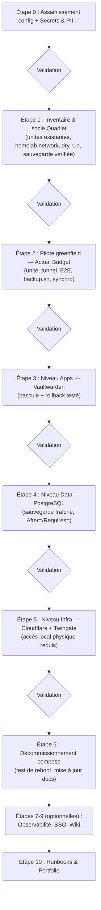

# Plan de Migration : Podman Compose → Quadlet (systemd)

## Contexte et décision d'architecture

La stack de production du serveur homelab (Podman rootless, 3 niveaux : `infra/` → `data/` → `apps/`) **reste en place** : aucune migration vers Kubernetes n'est effectuée sur ce serveur. Décision motivée par :

- **Sécurité** : la posture rootless actuelle est plus stricte au niveau du nœud que celle d'un cluster kubeadm/CRI-O (runtime rootful). Elle est conservée intégralement.
- **Sobriété matérielle** : le serveur dispose d'un CPU modeste (2 cœurs / 4 threads) et héberge des services critiques 24/7. Un control-plane Kubernetes permanent imposerait une charge disproportionnée.
- **Criticité** : Vaultwarden est le gestionnaire de mots de passe du foyer — le risque d'une migration d'orchestrateur complet dépasse son bénéfice d'apprentissage.

L'évolution retenue est la migration de l'orchestration **`podman-compose` → Quadlet** (unités systemd natives de Podman) : même runtime, mêmes images, mêmes volumes nommés, même réseau — seul le gestionnaire de cycle de vie change.

> L'apprentissage Kubernetes/OpenShift se fait sur du matériel personnel séparé (clusters jetables, bac à sable cloud) et est **hors du périmètre de ce dépôt et de ce serveur**.

## Pourquoi Quadlet ?

- **Direction soutenue par l'écosystème Red Hat** : `podman-compose` est un outil communautaire en retrait ; Quadlet est la voie native intégrée à Podman pour les déploiements systemd.
- **Cycle de vie systemd complet** : démarrage au boot dans le bon ordre (dépendances `After=`/`Requires=` entre niveaux), redémarrage supervisé, journalisation via `journalctl --user`.
- **Rootless inchangé** : les unités Quadlet s'exécutent en mode utilisateur (`~/.config/containers/systemd/`), avec `loginctl enable-linger` déjà en place.
- **IaC conservé** : les unités `.container`/`.network` sont des fichiers texte versionnés dans ce dépôt (ex. `apps/quadlet/`), déployés par `git pull` + copie vers `~/.config/containers/systemd/` + `systemctl --user daemon-reload`. Les secrets restent dans les `.env` non versionnés, consommés via `EnvironmentFile=`.
- **Compétence valorisable** : la syntaxe unit-file et la gestion systemd sont des compétences transverses (serveurs Linux d'entreprise, edge computing).

## Principes de sécurité (inchangés, Security by Design / OWASP)

- **Rootless** : aucune unité système (root) ; tout reste en unités utilisateur.
- **Zéro port entrant** : posture Zero Trust conservée (Cloudflare Tunnel / Twingate sortants uniquement).
- **Secrets** : fichiers `.env` uniquement, jamais de valeur en dur dans un fichier versionné.
- **Versions épinglées** : tags précis dans les unités `.container` (jamais `latest`), sans exposition des versions dans les diagrammes publics.
- **Aucune information personnelle ou d'identification** dans les fichiers versionnés (règle Secrets & PII de `.agents/rules/homelab-devops.md`).
- **Sauvegarde vérifiée avant toute bascule** touchant PostgreSQL ou les volumes applicatifs.
- **Rollback permanent** : à chaque étape de migration, l'ancien chemin (`podman-compose -f <stage>/compose.yml up -d`) reste fonctionnel tant que la migration complète n'est pas validée.

## Stratégie : pilote greenfield, puis migration par rayon d'impact croissant

1. **Pilote : Actual Budget (nouveau service, risque zéro)** — un service neuf n'a ni données ni utilisateurs : idéal pour apprendre le workflow Quadlet (écriture d'unité, `EnvironmentFile=`, réseau, routage tunnel, sauvegarde) sans aucun risque de coupure.
2. **`apps/` (Vaultwarden)** — documenté comme arrêtable/redémarrable sans couper l'accès distant.
3. **`data/` (PostgreSQL)** — coupure brève tolérée, après vérification de sauvegarde.
4. **`infra/` en dernier** — ligne de vie de l'accès distant ; bascule uniquement avec accès local physique.

## Feuille de route (validation étape par étape)

### Étape 0 — Assainissement des fichiers de configuration ✅
- [x] Redaction des identifiants réels, généralisation matériel/stockage, règle Secrets & PII
- [x] Versions épinglées (`apps/compose.yml`), correction `.gitignore`
- [ ] Commit et push de l'ensemble (en attente de validation)

### Étape 1 — Inventaire et socle Quadlet
- [ ] Inventorier les unités systemd/Quadlet existantes (`systemctl --user list-units`, règle opérationnelle obligatoire)
- [ ] Vérifier `loginctl enable-linger` et la version de Podman (support Quadlet)
- [ ] Créer l'unité réseau `homelab.network` (réseau `homelab_net` existant référencé ou géré)
- [ ] Valider la syntaxe des unités avec `/usr/libexec/podman/quadlet -dryrun -user`
- [ ] Vérifier l'intégrité de la dernière sauvegarde avant toute action

### Étape 2 — Pilote greenfield : Actual Budget (sync server)
- [ ] Écrire `actual-budget.container` : image `docker.io/actualbudget/actual-server` épinglée, volume nommé pour les données SQLite, `EnvironmentFile=`, réseau `homelab_net`, limites de ressources
- [ ] Ajouter la route Cloudflare Tunnel vers le service (même modèle que Vaultwarden : zéro port entrant, HTTPS partout)
- [ ] Activer le mot de passe serveur et le **chiffrement de bout en bout** des fichiers de budget (les données restent chiffrées au repos côté serveur)
- [ ] Étendre `scripts/backup.sh` au volume Actual Budget (fichiers SQLite)
- [ ] Vérifier la synchronisation depuis l'application desktop et un navigateur mobile
- [ ] Runbook de l'étape rédigé — ce workflow devient le modèle des migrations suivantes

### Étape 3 — Migration : niveau Apps (Vaultwarden)
- [ ] Écrire `vaultwarden.container` (image épinglée, `EnvironmentFile=`, volume nommé, réseau, limites de ressources)
- [ ] Arrêter le service compose, démarrer l'unité Quadlet, vérifier l'accès via Cloudflare Tunnel
- [ ] Procédure de rollback testée : arrêt de l'unité → `podman-compose up -d` → service restauré
- [ ] Runbook de l'étape rédigé

### Étape 4 — Migration : niveau Data (PostgreSQL)
- [ ] Sauvegarde `pg_dumpall` fraîche + vérification d'intégrité **avant** la bascule
- [ ] Écrire `postgres.container` (volume nommé existant réutilisé, `EnvironmentFile=`)
- [ ] Bascule compose → Quadlet, vérification de la connexion Vaultwarden → PostgreSQL
- [ ] Dépendance systemd : Vaultwarden démarre après PostgreSQL (`After=`/`Requires=`)
- [ ] Runbook de l'étape rédigé

### Étape 5 — Migration : niveau Infra (Cloudflare Tunnel + Twingate)
- [ ] **Prérequis : accès local physique au serveur disponible**
- [ ] Écrire `cloudflared.container` et `twingate-connector.container` (IP statique conservée)
- [ ] Bascule, vérification de l'accès distant complet (HTTPS + VPN Zero Trust)
- [ ] Runbook de l'étape rédigé

### Étape 6 — Décommissionnement de podman-compose
- [ ] Test de redémarrage complet du serveur : toutes les unités démarrent au boot dans le bon ordre
- [ ] Mise à jour du README et de `.agents/workflows/deploy-stage.md` (workflow Quadlet remplaçant le workflow compose)
- [ ] Les fichiers `compose.yml` sont conservés dans le dépôt à titre de documentation historique et de solution de secours, avec une note d'obsolescence
- [ ] Vérifier `scripts/backup.sh` (les noms de conteneurs restant identiques, l'impact attendu est nul)

### Étape 7 — Observabilité légère (optionnelle)
- [ ] Prometheus + Grafana + node_exporter comme unités Quadlet avec limites de ressources strictes
- [ ] Tableaux de bord : santé des conteneurs, ressources hôte, sauvegardes

### Étape 8 — SSO (optionnelle)
- [ ] Comparer Keycloak / Authentik au regard des ressources du serveur
- [ ] Déployer le choix retenu comme unité Quadlet

### Étape 9 — Documentation auto-hébergée (optionnelle)
- [ ] Choisir BookStack / Wiki.js, déployer comme unité Quadlet

### Étape 10 — Runbooks & portfolio
- [ ] Consolider les runbooks des étapes 2-6 (démarche, incidents, rollback) pour usage portfolio, sans éléments personnels

## Architecture cible

Posture inchangée : rootless, zéro port entrant, secrets via `EnvironmentFile=` (fichiers `.env` non versionnés).

## Feuille de route visuelle

Chaque « Validation » est un point d'arrêt : aucune étape suivante sans accord explicite.
