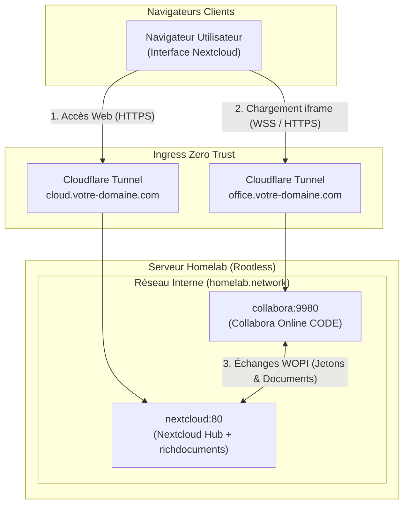

# Runbook — Quadlet : Déploiement et exploitation de Collabora Online CODE (Suite bureautique)

Ce runbook détaille l'architecture, le déploiement et l'exploitation de **Collabora Online Development Edition (CODE)** (`docker.io/collabora/code`) intégré à **Nextcloud Hub** sous forme d'unité Podman Quadlet systemd rootless.

---

## 1. Rôle et Architecture WOPI

Collabora Online permet l'affichage et l'édition collaborative en temps réel des documents bureautiques (`.docx`, `.xlsx`, `.pptx`, `.odt`, `.ods`, `.odp`) directement dans l'interface web de Nextcloud sans dépendre d'une suite propriétaire (Microsoft 365 ou Google Docs).

### Flux d'intégration WOPI (Web Application Open Platform Interface)



- **Protocole WOPI :** Nextcloud agit en tant qu'hôte WOPI (`WOPI Host`) ; Collabora restitue l'interface d'édition via WebSocket (`WSS`) et enregistre les modifications directement dans le stockage Nextcloud (`apps_nextcloud_data`).
- **Stateless (Sans état) :** Le conteneur Collabora ne conserve aucun fichier sur disque : aucun volume de stockage persistant n'est nécessaire.

---

## 2. Fichiers IaC Impliqués

| Fichier (dépôt) | Rôle |
|---|---|
| `apps/quadlet/collabora.container` | Déclaration Quadlet de l'unité conteneur (1024 Mo RAM / 1.0 vCPU) |
| `apps/collabora.env.example` | Modèle de configuration déclarative (domaines, console admin, paramètres SSL et sandbox) |
| `apps/glance.env.example` | Définition de l'URL publique `URL_COLLABORA` pour le tableau de bord |
| `apps/glance/glance.yml` | Raccourci vers la console d'administration Collabora |
| `docs/runbooks/quadlet-collabora.md` | Ce guide opérationnel de référence |

---

## 3. Spécificités Rootless Podman & Sécurité

### Désactivation de la jail chroot (`mount_jail_tree=false`)
Collabora Online utilise par défaut un système de bac à sable (*sandbox*) fondé sur des montages chroot (`mount namespaces`). Dans un environnement **Podman rootless** :
- L'utilisateur non privilégié ne dispose pas de la capacité d'effectuer des montages arbitraires (`EPERM`).
- La directive `extra_params=--o:ssl.enable=false --o:ssl.termination=true --o:mount_jail_tree=false` désactive le montage de jail tout en conservant l'isolation de processus native des conteneurs Linux et les cgroups rootless.

### Confinement & Cgroups
- **Mémoire plafonnée :** `--memory=1024m` (consommation typique : ~180 Mo au repos, ~400 Mo lors de l'édition simultanée).
- **Processeur plafonné :** `--cpus=1.0`.
- **Privilèges :** `NoNewPrivileges=true` activé.

---

## 4. Procédure de Déploiement sur le Serveur

### Étape 1 : Préparation du fichier d'environnement

Se connecter en SSH au serveur (`homelab@device-4`) et initialiser le fichier d'environnement :

```bash
cd ~/homelab
cp apps/collabora.env.example apps/collabora.env
chmod 600 apps/collabora.env
```

Éditer `apps/collabora.env` avec les valeurs réelles :

```bash
# Exemple de configuration réelle :
server_name=office.votre-domaine.com
aliasgroup1=https://cloud.votre-domaine.com,https://cloud\\.votre-domaine\\.com,https://cloud.votre-domaine.com:443,https://cloud\\.votre-domaine\\.com:443
username=admin
password=DEFINIR_UN_MOT_DE_PASSE_ADMIN_ROBUSTE
extra_params=--o:ssl.enable=false --o:ssl.termination=true --o:mount_jail_tree=false
```

Valider la conformité du fichier avec le script d'audit :

```bash
bash scripts/check-env.sh apps/collabora.env
```

### Étape 2 : Déploiement de l'unité Quadlet

Copier l'unité dans le répertoire Quadlet systemd de l'utilisateur :

```bash
cp apps/quadlet/collabora.container ~/.config/containers/systemd/

# Vérifier la génération sans erreur par le générateur Quadlet
/usr/libexec/podman/quadlet -dryrun -user

# Recharger systemd et démarrer le service
systemctl --user daemon-reload
systemctl --user start collabora.service
systemctl --user enable collabora.service
```

Vérifier que le conteneur est actif et en écoute :

```bash
systemctl --user status collabora.service
podman logs --tail 30 collabora
```

### Étape 3 : Routage Cloudflare Tunnel (Ingress)

Dans la console **Cloudflare Zero Trust** (ou via le fichier de configuration `cloudflared`) :
1. Ajouter un hostname public : `office.votre-domaine.com`.
2. Service : `HTTP`.
3. URL : `collabora:9980` (accessible via le réseau virtuel `homelab.network`).
4. Paramètres TLS supplémentaires : Activer **HTTP2** et **WebSockets**.

### Étape 4 : Activation et Liaison dans Nextcloud Office

Exécuter les commandes `occ` au sein du conteneur Nextcloud existant :

```bash
# 1. Vérifier si l'application Nextcloud Office (richdocuments) est installée, sinon l'activer
podman exec -u www-data nextcloud php occ app:install richdocuments 2>/dev/null || podman exec -u www-data nextcloud php occ app:enable richdocuments

# 2. Configurer l'URL du serveur Collabora Online
podman exec -u www-data nextcloud php occ config:app:set richdocuments wopi_url --value="https://office.votre-domaine.com"
podman exec -u www-data nextcloud php occ config:app:set richdocuments public_wopi_url --value="https://office.votre-domaine.com"

# 3. Vérifier la connectivité WOPI depuis Nextcloud
podman exec -u www-data nextcloud php occ richdocuments:activate-config
```

---

## 5. Validation & Tests Opérationnels

1. **Test de découverte WOPI locale (Discovery XML) :**
   ```bash
   podman run --rm --network homelab.network docker.io/curlimages/curl:8.12.1 -s http://collabora:9980/hosting/discovery | grep -i "wopi-discovery"
   ```
   *Résultat attendu : Un flux XML listant les capacités de traitement MimeType.*

2. **Test de la console d'administration :**
   Accéder dans le navigateur à `https://office.votre-domaine.com/browser/dist/admin/admin.html` et s'authentifier avec `username` et `password` définis dans `collabora.env`.

3. **Test d'édition de document :**
   Ouvrir Nextcloud (`https://cloud.votre-domaine.com`), créer un nouveau document texte ou tableur et vérifier que l'éditeur Collabora s'ouvre sans erreur de certificat ni blocage de contenu mixte.

---

## 6. Exploitation & Dépannage

### Erreur : `EPERM` ou échec de démarrage de `coolwsd`
- **Cause :** Collabora tente d'utiliser les namespaces de montage chroot non autorisés en rootless.
- **Remède :** S'assurer que `extra_params` contient bien `--o:mount_jail_tree=false` dans `apps/collabora.env` et redémarrer :
  ```bash
  systemctl --user restart collabora.service
  ```

### Erreur : « Hôte WOPI non autorisé » lors de l'ouverture d'un fichier Nextcloud
- **Cause :** L'URL de Nextcloud transmise dans le paramètre `WOPISrc` (sans le port `:443` en HTTPS standard) n'est pas acceptée par la regex `aliasgroup1`.
- **Remède :** Configurer `aliasgroup1` en couvrant les formes avec et sans port `:443`, ainsi que les formes avec et sans échappement de point :
  ```bash
  aliasgroup1=https://cloud.votre-domaine.com,https://cloud\\.votre-domaine\\.com,https://cloud.votre-domaine.com:443,https://cloud\\.votre-domaine\\.com:443
  ```
  Puis redémarrer l'unité : `systemctl --user restart collabora.service`.

### Consultation des journaux :
```bash
journalctl --user -u collabora.service -n 50 --no-pager
podman logs -f collabora
```
