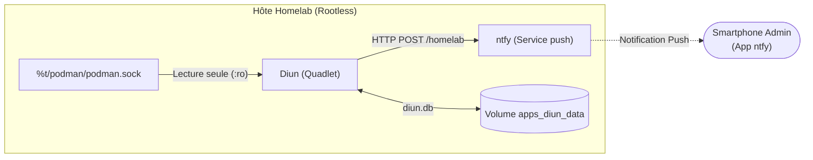

# Runbook — Quadlet : Surveillance et Notifications de Mises à Jour avec Diun

Ce runbook détaille le déploiement, l'exploitation et la sauvegarde de l'agent **Diun** (*Docker Image Update Notifier*) sous forme d'unités déclaratives Quadlet systemd rootless.

---

## 1. Rôle et Architecture

Diun (`docker.io/crazymax/diun:4.33.0`) est un démon autonome écrit en Go conçu pour surveiller les registres de conteneurs et envoyer des notifications push dès qu'une nouvelle version d'une image déployée est disponible :

- **Surveillance Déclarative :** Interroge le socket Podman rootless local à intervalles réguliers (cron paramétrable, par défaut toutes les 6 heures).
- **Notification Push Instantanée :** Envoie des alertes directement sur le canal auto-hébergé **ntfy** (`http://ntfy:80`) pour alerter l'administrateur sur son smartphone.
- **Anti-Spam & Persistance :** Mémorise les signatures (digest manifest) des images déjà analysées dans une base de données embarquée (`/data/diun.db`) pour éviter tout envoi répétitif.
- **Ultra-léger :** Consommation mémoire maîtrisée (~20 à 35 Mo de RAM), plafonnée à 64 Mo par les cgroups v2.



---

## 2. Fichiers IaC Impliqués

| Fichier (dépôt)               | Rôle                                                                                          |
| ----------------------------- | --------------------------------------------------------------------------------------------- |
| `apps/quadlet/diun.container` | Unité conteneur Quadlet (image `docker.io/crazymax/diun:4.33.0`, 64 Mo RAM / 0.25 vCPU)       |
| `apps/quadlet/diun.volume`    | Volume nommé `apps_diun_data` (persistance de la base locale `/data/diun.db`)                 |
| `apps/diun.env.example`       | Modèle de configuration déclarative (fréquence cron, endpoint ntfy, topic)                     |
| `scripts/backup.sh`           | Sauvegarde quotidienne du volume `apps_diun_data` avec contrôle d'intégrité gzip               |

---

## 3. Sécurité Rootless & Permissions Socket

Pour fonctionner en environnement rootless sécurisé sans privilège root :

1. **Montage du socket Podman :** Le socket utilisateur `%t/podman/podman.sock` est monté en lecture seule vers `/var/run/docker.sock:ro`.
2. **Désactivation du label SELinux (`SecurityLabelDisable=true`) :** Comme pour `forgejo-runner`, ce réglage autorise le conteneur confiné à communiquer avec le socket Unix situé dans `/run/user/1000/podman/`.
3. **Dépendance systemd :** L'unité déclare `Requires=podman.socket` pour garantir que le socket d'API est ouvert et écoute avant le lancement du conteneur.

---

## 4. Procédure de Déploiement sur le Serveur

### Étape 1 : Préparation du fichier d'environnement

```bash
cd ~/homelab
cp apps/diun.env.example apps/diun.env
chmod 600 apps/diun.env
```

Vérifier et ajuster les paramètres selon le besoin :

- `DIUN_NOTIF_NTFY_TOPIC` : Topic ntfy abonné sur votre smartphone (par défaut `homelab`).
- `DIUN_WATCH_SCHEDULE` : Fréquence du balayage (par défaut `0 */6 * * *`, toutes les 6 heures).
- `DIUN_NOTIF_NTFY_TOKEN` : Jeton d'authentification Bearer obligatoire si le serveur ntfy est en mode `NTFY_AUTH_DEFAULT_ACCESS=deny-all`. Le compte de service dédié est `svc-diun` (architecture Zero Trust).

Créer le compte de service et générer le jeton si ce n'est pas encore fait :

```bash
# Créer l'utilisateur de service dédié Diun
podman exec -it ntfy ntfy user add svc-diun

# Autoriser uniquement l'écriture sur le topic 'homelab' (principe du moindre privilège)
podman exec -it ntfy ntfy access svc-diun homelab write-only

# Générer un jeton labellisé (note le token affiché : tk_...)
podman exec -it ntfy ntfy token add --label="diun" svc-diun

# Renseigner le jeton dans apps/diun.env :
# DIUN_NOTIF_NTFY_TOKEN=tk_...
```

Valider la conformité du fichier avec le validateur interne :

```bash
./scripts/check-env.sh apps/diun.env
```

### Étape 2 : Déploiement des unités Quadlet

```bash
cp apps/quadlet/diun.{container,volume} ~/.config/containers/systemd/

# Validation syntaxique Quadlet
/usr/libexec/podman/quadlet -dryrun -user

# Rechargement systemd et activation du socket Podman si nécessaire
systemctl --user daemon-reload
systemctl --user enable --now podman.socket

# Démarrage de Diun
systemctl --user start diun
systemctl --user status diun --no-pager
```

### Étape 3 : Contrôle des journaux d'exécution

```bash
journalctl --user -u diun -f
```

Un démarrage réussi affiche l'initialisation du fournisseur Docker et la confirmation du cron planifié :
```
INFO Diun version 4.33.0 ...
INFO Cron initialized with schedule 0 */6 * * *
INFO Docker provider initialized
```

---

## 5. Test et Déclenchement Manuel

Pour valider l'interconnexion Diun → ntfy sans attendre la prochaine itération cron :

```bash
# Vérification de l'accès réseau direct vers ntfy
podman exec -it diun wget -qO- http://ntfy:80/v1/health

# Déclenchement d'une vérification immédiate des images
podman exec -it diun diun notif test
```

Une notification de test intitulée `Diun test notification` doit apparaître instantanément sur l'application ntfy de votre smartphone.

---

## 6. Sauvegarde et Résilience

La base de données `/data/diun.db` est couverte par `scripts/backup.sh` sous l'entrée :
```bash
"apps_diun_data:diun:de Diun:optionnel"
```

- **Archive générée :** `diun_data_<TIMESTAMP>.tar.gz` dans le répertoire des sauvegardes.
- **Restauration :** En cas de perte de volume, Diun recrée simplement son fichier de base au démarrage et effectue un scan complet des images sans impacter les services hôtes.

---

## 7. Procédure de Rollback (Retour Arrière)

En cas d'anomalie ou de régression sur le service Diun :

```bash
# 1. Arrêter le conteneur systemd
systemctl --user stop diun

# 2. Retirer les unités Quadlet de la configuration active
rm -f ~/.config/containers/systemd/diun.{container,volume}

# 3. Recharger le démon systemd
systemctl --user daemon-reload

# 4. Supprimer le conteneur résiduel si nécessaire
podman rm -f diun
```

Pour restaurer une version précédente de l'unité Quadlet à partir de l'historique Git :
```bash
git -C ~/homelab checkout <commit-sha> -- apps/quadlet/diun.container
cp ~/homelab/apps/quadlet/diun.container ~/.config/containers/systemd/
systemctl --user daemon-reload && systemctl --user start diun
```

---

## 8. Leçons Retenues & Bonnes Pratiques

- **Isolation Zero Trust ntfy (`svc-diun`) :** Avec la directive `NTFY_AUTH_DEFAULT_ACCESS=deny-all`, toute publication anonyme renvoie une erreur HTTP 403. Plutôt que de réutiliser un compte partagé, Diun dispose de son propre compte de service dédié `svc-diun`, confiné en `write-only` sur le topic `homelab`. Un jeton compromis n'expose aucun autre canal ni aucun droit de lecture.
- **Confinement SELinux sur Socket Unix :** La communication entre le conteneur confiné et le socket API Podman rootless (`%t/podman/podman.sock`) impose la directive `SecurityLabelDisable=true`. Sans celle-ci, SELinux bloque silencieusement les requêtes HTTP Unix et Diun échoue à initialiser le fournisseur Docker.
- **Persistance Anti-Spam (`diun.db`) :** Le volume nommé `apps_diun_data` protège l'administrateur contre les tempêtes d'alertes : Diun stocke les empreintes (digests SHA-256) des manifestes distants déjà analysés. Si ce volume était éphémère, chaque redémarrage du conteneur déclencherait à nouveau 18 notifications simultanées.
- **Dépendance explicite systemd :** L'ajout de `Requires=podman.socket` et `After=podman.socket` garantit que le socket d'écoute utilisateur est opérationnel avant que Diun ne tente de s'y connecter au démarrage du système.
