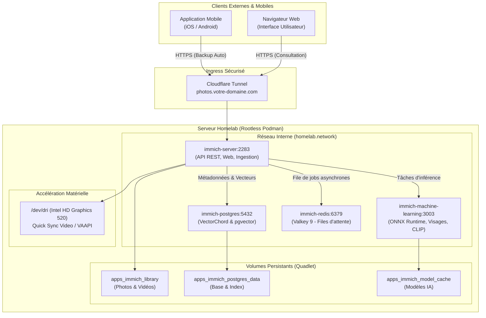

# Runbook — Quadlet : Déploiement et exploitation d'Immich (Gestionnaire Photos & Vidéos)

Ce runbook détaille l'architecture, le déploiement et l'exploitation de la suite souveraine de sauvegarde et gestion multimédia **Immich** sous forme d'unités Podman Quadlet systemd rootless.

---

## 1. Rôle et Architecture du Service

Immich est une solution auto-hébergée haute performance conçue pour remplacer des services propriétaires tels que Google Photos, iCloud Photos ou OneDrive. Elle offre une interface web moderne, des applications mobiles iOS et Android avec sauvegarde automatique en arrière-plan, la reconnaissance faciale, l'indexation sémantique (recherche naturelle via CLIP) et le transcodage matériel vidéo.

### Schéma d'Architecture Multi-Conteneurs



---

## 2. Fichiers IaC Impliqués

| Fichier (dépôt) | Rôle |
|---|---|
| `apps/quadlet/immich-server.container` | Déclaration Quadlet du serveur applicatif principal (1024 Mo RAM / 1.0 vCPU) |
| `apps/quadlet/immich-machine-learning.container` | Déclaration du moteur d'apprentissage automatique (1536 Mo RAM / 1.5 vCPU) |
| `apps/quadlet/immich-postgres.container` | Base de données vectorielle dédiée VectorChord (512 Mo RAM / 0.5 vCPU, 128 Mo shm) |
| `apps/quadlet/immich-redis.container` | Cache et gestionnaire de files de tâches Valkey (128 Mo RAM / 0.25 vCPU) |
| `apps/quadlet/immich-library.volume` | Volume persistant pour la photothèque (`apps_immich_library`) |
| `apps/quadlet/immich-postgres.volume` | Volume persistant PostgreSQL (`apps_immich_postgres_data`) |
| `apps/quadlet/immich-model-cache.volume` | Volume persistant pour le cache des modèles ONNX (`apps_immich_model_cache`) |
| `apps/immich.env.example` | Modèle de configuration pour l'ensemble des conteneurs de la pile |
| `apps/glance.env.example` | Définition de l'URL publique `URL_IMMICH` pour le tableau de bord |
| `apps/glance/glance.yml` | Moniteur d'état de santé et lien d'accès au service |
| `scripts/backup.sh` | Sauvegarde logique automatique de PostgreSQL Immich et de la photothèque |

---

## 3. Choix d'Ingénierie & Spécificités Techniques

### Base de données vectorielle dédiée vs Base centrale
Immich requiert l'extension C spécialisée **VectorChord** pour exécuter les calculs de distance euclidienne et cosinus sur les plongements vectoriels (embeddings) d'images et de visages. Pour éviter de corrompre le conteneur PostgreSQL central du homelab (qui héberge Nextcloud et Vaultwarden) et pour garantir la compatibilité ascendante lors des mises à jour amont, Immich dispose de son propre conteneur `immich-postgres` (`ghcr.io/immich-app/postgres:14-vectorchord0.4.3-pgvectors0.2.0`).

### Accélération Matérielle Quick Sync (`/dev/dri`)
Le transcodage vidéo à la volée est délégué au GPU intégré Intel HD Graphics 520 via le périphérique `/dev/dri`.
- Configuration Quadlet : `PodmanArgs=--device=/dev/dri --memory=1024m --cpus=1.0`
- **Avantage :** Soulage entièrement les 2 cœurs du CPU Intel Core i7-6500U lors de la lecture de vidéos 4K/H.265 sur les applications mobiles.

### Confinement des Ressources & Cgroups
La pile complète Immich est plafonnée à un maximum strict d'environ **3.2 Go de RAM** cumulée, évitant tout risque de saturation de la mémoire vive de l'hôte (16 Go disponibles).

---

## 4. Procédure de Déploiement

### Étape 1 : Préparer le fichier de variables d'environnement sur le serveur
Sur l'hôte homelab, générer un mot de passe robuste et créer le fichier d'environnement :
```bash
cp ~/homelab/apps/immich.env.example ~/homelab/apps/immich.env
chmod 600 ~/homelab/apps/immich.env
nano ~/homelab/apps/immich.env
```
Remplacer `your_secure_immich_db_password_here` par une clé aléatoire alphanumérique sécurisée (à la fois pour `DB_PASSWORD` et `POSTGRES_PASSWORD`).

### Étape 2 : Déploiement des unités Quadlet
Copier les unités dans l'arborescence systemd utilisateur :
```bash
cp ~/homelab/apps/quadlet/immich-*.volume ~/.config/containers/systemd/
cp ~/homelab/apps/quadlet/immich-*.container ~/.config/containers/systemd/

systemctl --user daemon-reload
```

### Étape 3 : Démarrage ordonné des services
Démarrer d'abord l'infrastructure sous-jacente, puis le serveur applicatif :
```bash
systemctl --user start immich-postgres immich-redis immich-machine-learning
systemctl --user start immich-server
```

Vérifier l'état de fonctionnement :
```bash
systemctl --user status immich-server --no-pager
podman ps --filter "name=immich"
```

---

## 5. Ingress & Exposition Réseau (Cloudflare Zero Trust)

Pour permettre la synchronisation mobile depuis n'importe où sans ouverture de ports pare-feu :

1. Dans la console Cloudflare Zero Trust (Tunnels) :
   - Service public : `photos.votre-domaine.com`
   - Type : `HTTP`
   - URL : `127.0.0.1:2283` (ou `http://immich-server:2283` sur le réseau Podman)
2. Paramètres de requête recommandés pour les gros volumes de photos :
   - Augmenter le timeout de requête (*HTTP Request Timeout*) à `300s`.
   - Activer le chunking automatique dans l'application mobile pour respecter la limite d'envoi Cloudflare (100 Mo par requête).

---

## 6. Surveillance & Santé

- **Sonde HTTP Glance :** `http://immich-server:2283/api/server/ping` (renvoie `pong` avec code 200).
- **Journaux applicatifs en direct :**
  ```bash
  journalctl --user -u immich-server -f
  journalctl --user -u immich-machine-learning -f
  ```
- **Vérification de l'accélération matérielle iGPU :**
  ```bash
  podman exec -it immich-server ls -la /dev/dri
  ```

---

## 7. Sauvegarde & Restauration

La sauvegarde est intégrée nativement dans `scripts/backup.sh` :
1. **Sauvegarde relationnelle et vectorielle :** Dump logique compressé de la base de données via `podman exec immich-postgres pg_dumpall -U postgres | gzip > backup/immich/immich_db_*.sql.gz`.
2. **Sauvegarde de la photothèque :** Archive tarball compressée du volume `apps_immich_library`.
