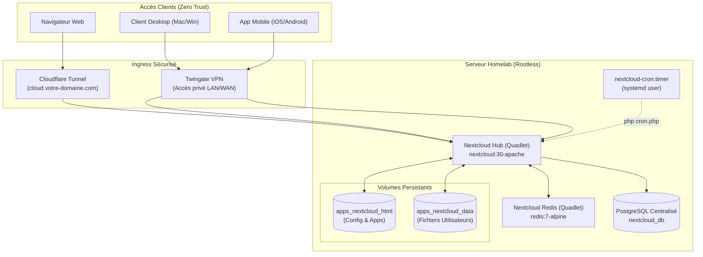

# Runbook — Quadlet : Déploiement et exploitation de Nextcloud Hub (Cloud & Fichiers)

Ce runbook détaille l'architecture, le déploiement et l'exploitation de la plateforme **Nextcloud Hub** (`docker.io/library/nextcloud:30.0.6-apache`) sous forme d'unités déclaratives Podman Quadlet systemd rootless.

---

## 1. Rôle et Architecture

Nextcloud constitue le cœur du remplacement de Microsoft 365 / OneDrive pour le homelab :
- **Synchronisation de fichiers multi-plateformes :** Prise en charge native des clients de synchronisation Windows, macOS, Linux, iOS et Android (avec chargement automatique des photos).
- **Architecture 3-tiers étanche :**
  - **Front-end / Moteur PHP :** Nextcloud Apache conteneurisé.
  - **Cache transactionnel & Verrous de fichiers :** Instance Redis dédiée (`nextcloud-redis`) pour éliminer les contentions de base de données.
  - **Base relationnelle (Data Tier) :** PostgreSQL centralisé (`postgres-db:5432`) avec utilisateur et base dédiés non-superuser.
  - **Tâches d'arrière-plan :** Minuteur systemd natif hôte (`nextcloud-cron.timer`) exécutant les tâches périodiques toutes les 15 minutes sans surcharge web.



---

## 2. Fichiers IaC Impliqués

| Fichier (dépôt) | Rôle |
|---|---|
| `apps/quadlet/nextcloud.container` | Unité conteneur Quadlet Nextcloud (limites : 1024 Mo RAM / 1.0 vCPU) |
| `apps/quadlet/nextcloud-html.volume` | Volume nommé `apps_nextcloud_html` (code, apps tierces, config) |
| `apps/quadlet/nextcloud-data.volume` | Volume nommé `apps_nextcloud_data` (documents et fichiers des utilisateurs) |
| `apps/quadlet/nextcloud-redis.container` | Unité conteneur Redis dédié (cache mémoire & locking, 128 Mo RAM) |
| `apps/quadlet/nextcloud-redis.volume` | Volume nommé `apps_nextcloud_redis_data` (persistance Redis RDB) |
| `apps/nextcloud.env.example` | Modèle de configuration déclarative (variables DB, Redis, domaines de confiance) |
| `scripts/systemd/nextcloud-cron.service` | Unité de service systemd pour exécuter `cron.php` |
| `scripts/systemd/nextcloud-cron.timer` | Minuteur systemd déclenché toutes les 15 minutes |
| `scripts/backup.sh` | Sauvegarde automatique des volumes et du dump PostgreSQL |

---

## 3. Modèle de Persistance et Base de Données

Nextcloud adopte une séparation stricte entre configuration applicative et données massives :
1. **`apps_nextcloud_html` :** Contient le serveur web, le noyau Nextcloud, les applications activées et le fichier de configuration `config/config.php`.
2. **`apps_nextcloud_data` :** Dédié exclusivement au stockage brut des fichiers téléversés par les 3 utilisateurs sur le SSD interne (~890 Go disponibles).
3. **Base de données PostgreSQL (`nextcloud_db`) :** Hébergée sur l'instance PostgreSQL centrale du niveau Data (`postgres-db`), opérée sous un compte dédié `nextcloud_user` (principe du moindre privilège OWASP).

---

## 4. Sécurité Rootless & Confinement

- **Confinement Cgroups :** Plafonnement strict des ressources pour garantir qu'une synchronisation massive de fichiers n'asphyxie pas le reste du homelab :
  - Nextcloud : `--memory=1024m --cpus=1.0`
  - Redis : `--memory=128m --cpus=0.25`
- **Sécurité Linux :** `NoNewPrivileges=true` activé sur les conteneurs.
- **Posture Zero Trust :** Aucun port hôte publié. L'accès s'effectue exclusivement via le réseau virtuel interne `homelab.network`.

---

## 5. Procédure de Déploiement sur le Serveur

### Étape 1 : Initialisation de la base de données PostgreSQL

Se connecter en SSH au serveur et créer le rôle et la base de données dédiés :

```bash
# Générer un mot de passe sécurisé et créer l'utilisateur ainsi que la base Nextcloud
podman exec -i postgres-db psql -U postgres << 'EOF'
CREATE USER nextcloud_user WITH PASSWORD 'DEFINIR_UN_MOT_DE_PASSE_SECURISE';
CREATE DATABASE nextcloud_db OWNER nextcloud_user;
GRANT ALL PRIVILEGES ON DATABASE nextcloud_db TO nextcloud_user;
\c nextcloud_db
GRANT ALL ON SCHEMA public TO nextcloud_user;
EOF
```

### Étape 2 : Préparation du fichier d'environnement

```bash
cd ~/homelab
git switch feat/apps-nextcloud && git pull
cp apps/nextcloud.env.example apps/nextcloud.env
chmod 600 apps/nextcloud.env
```

Éditer `apps/nextcloud.env` :
- Renseigner `POSTGRES_PASSWORD` avec le mot de passe défini à l'étape 1.
- Renseigner `NEXTCLOUD_ADMIN_PASSWORD` pour le mot de passe du compte `admin`.
- Valider le fichier avec le linter interne :
  ```bash
  ./scripts/check-env.sh apps/nextcloud.env
  ```

### Étape 3 : Déploiement des unités Quadlet

```bash
# 1. Copier les unités Quadlet dans le dossier systemd utilisateur
cp apps/quadlet/nextcloud*.{container,volume} ~/.config/containers/systemd/

# 2. Valider la syntaxe déclarative Quadlet
/usr/libexec/podman/quadlet -dryrun -user

# 3. Recharger systemd et démarrer Redis puis Nextcloud
systemctl --user daemon-reload
systemctl --user start nextcloud-redis
systemctl --user start nextcloud

# 4. Contrôler le statut
systemctl --user status nextcloud --no-pager
```

### Étape 4 : Activation du minuteur systemd pour le cron

```bash
cp scripts/systemd/nextcloud-cron.{service,timer} ~/.config/systemd/user/
systemctl --user daemon-reload
systemctl --user enable --now nextcloud-cron.timer
systemctl --user list-timers nextcloud-cron.timer
```

Dans l'interface web Nextcloud (**Administration** → **Paramètres de base**), sélectionner le mode d'arrière-plan **Cron (système)**.

---

## 6. Configuration Réseau & Accès Zero Trust

### Accès Web Public (Cloudflare Tunnel)
Dans la console Cloudflare Zero Trust (Tunnels) :
- Ajouter un **Public Hostname** : `cloud.votre-domaine.com`
- Service : `HTTP` → `nextcloud:80`
- *(Rappel : Cloudflare applique une limite de 100 Mo par requête pour les uploads gratuits).*

### Accès Haut Débit & Gros Fichiers (Twingate VPN & LAN)
Pour synchroniser de gros volumes (vidéos, archives de plusieurs gigaoctets) sans restriction de taille :
- Connecter le client desktop/mobile au VPN **Twingate**.
- Pointer le client vers le nom DNS privé ou l'IP locale du serveur (`192.168.x.x`).

---

## 7. Sauvegarde, Restauration & Vérification

### Sauvegarde
La sauvegarde est intégrée dans `scripts/backup.sh` :
- `pg_dumpall` sauvegarde automatiquement la base `nextcloud_db`.
- Les volumes nommés `apps_nextcloud_html` et `apps_nextcloud_data` sont archivés quotidiennement sur `/mnt/backup_vault`.

### Restauration de test
```bash
# Tester l'intégrité de l'archive de configuration
tar -tzf /mnt/backup_vault/nextcloud/nextcloud_data_<TIMESTAMP>.tar.gz | grep "config.php"
```

---

## 8. Procédure de Rollback (Retour Arrière)

En cas de problème majeur lors du déploiement :

```bash
# 1. Stopper les services
systemctl --user stop nextcloud nextcloud-redis
systemctl --user disable --now nextcloud-cron.timer

# 2. Retirer les unités Quadlet et recharger systemd
rm -f ~/.config/containers/systemd/nextcloud*.{container,volume}
rm -f ~/.config/systemd/user/nextcloud-cron.*
systemctl --user daemon-reload

# 3. Supprimer les conteneurs résiduels
podman rm -f nextcloud nextcloud-redis
```
*(Les volumes `apps_nextcloud_data` et la base PostgreSQL sont préservés).*

---

## 9. Leçons Retenues & Bonnes Pratiques

- **Nécessité absolue de Redis pour les verrous de fichiers :** Sans instance Redis dédiée, Nextcloud utilise la base de données SQL pour verrouiller les fichiers en cours d'écriture (`file locking`). Lors de synchronisations massives (milliers de fichiers OneDrive), cela provoque des deadlocks PostgreSQL et paralyse le serveur. Redis garantit des verrous atomiques en mémoire ultra-rapides.
- **Bypass de la limite Cloudflare 100 Mo :** Pour ingérer les centaines de gigaoctets de données initiales depuis OneDrive, utiliser impérativement le réseau local (LAN) ou le tunnel Twingate SDN. Cloudflare Tunnel rejette systématiquement les fichiers individuels de plus de 100 Mo (`HTTP 413 Entity Too Large`).
- **Exécution native du cron via systemd :** Le mode AJAX par défaut de Nextcloud dépend des visites sur l'interface web pour purger les fichiers temporaires et vérifier les versions. Le minuteur systemd `nextcloud-cron.timer` garantit une maintenance périodique stricte toutes les 15 minutes, même si aucun utilisateur n'est connecté.
- **Sécurité et headers de proxy inverse :** Les directives `OVERWRITEPROTOCOL=https`, `OVERWRITEHOST` et `TRUSTED_PROXIES` sont indispensables pour éviter les boucles de redirection infinies et garantir que Nextcloud génère des URLs sécurisées derrière les tunnels.
