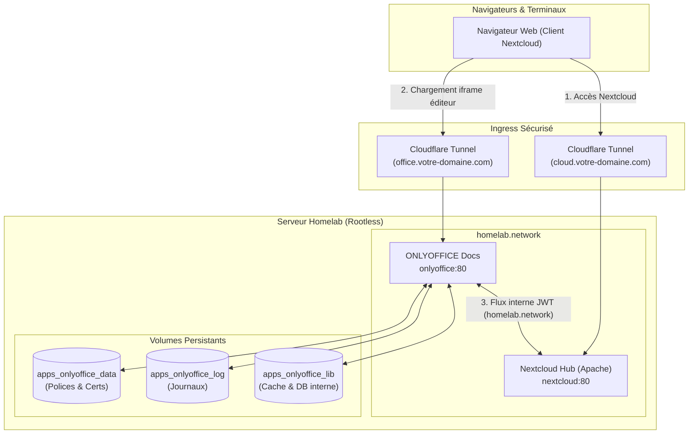

# Runbook — Quadlet : Déploiement et exploitation d'ONLYOFFICE Document Server

Ce runbook détaille l'architecture, le déploiement et l'intégration de la suite bureautique collaborative **ONLYOFFICE Document Server** (`docker.io/onlyoffice/documentserver`) sous forme d'unités déclaratives Podman Quadlet systemd rootless.

---

## 1. Rôle et Architecture

ONLYOFFICE Document Server complète la plateforme collaborative Nextcloud Hub pour assurer une parité fonctionnelle stricte avec Microsoft 365 (Word, Excel, PowerPoint) :
- **Édition collaborative en temps réel :** Prise en charge native et fluide des formats `.docx`, `.xlsx` et `.pptx` directement dans le navigateur sans conversion dégradante.
- **Sécurité cryptographique JWT :** Signature et validation systématique des jetons d'édition pour interdire toute falsification ou injection de documents.
- **Routage Hybride Optimisé (Zero Trust) :**
  - **Flux Client (Navigateur) :** Le client web télécharge l'interface d'édition depuis l'URL externe sécurisée (`https://office.votre-domaine.com`).
  - **Flux Serveur-à-Serveur (Backchannel) :** Les échanges lourds de conversion et de sauvegarde entre Nextcloud et ONLYOFFICE s'effectuent exclusivement en local via le réseau virtuel `homelab.network` (`http://onlyoffice:80` et `http://nextcloud:80`), évitant tout goulot d'étranglement ou plafond de requêtes externe.



---

## 2. Fichiers IaC Impliqués

| Fichier (dépôt) | Rôle |
|---|---|
| `apps/quadlet/onlyoffice.container` | Unité conteneur Quadlet ONLYOFFICE (limites : 2048 Mo RAM / 1.5 vCPU) |
| `apps/quadlet/onlyoffice-data.volume` | Volume nommé `apps_onlyoffice_data` (polices personnalisées et certificats) |
| `apps/quadlet/onlyoffice-log.volume` | Volume nommé `apps_onlyoffice_log` (journaux de diagnostic du moteur) |
| `apps/quadlet/onlyoffice-lib.volume` | Volume nommé `apps_onlyoffice_lib` (base interne et cache de conversion) |
| `apps/onlyoffice.env.example` | Modèle déclaratif pour les jetons JWT et la communication interne |
| `scripts/backup.sh` | Sauvegarde automatique quotidienne du volume `apps_onlyoffice_data` |

---

## 3. Confinement & Sécurité Rootless

- **Confinement Cgroups :** Plafonnement des ressources pour isoler les pics de compilation et de conversion de gros documents PDF/Excel :
  - ONLYOFFICE : `--memory=2048m --cpus=1.5`
- **Sécurité Linux :** `NoNewPrivileges=true` activé sur le conteneur.
- **Isolation Réseau :** Aucun port hôte publié. L'accès s'effectue exclusivement via le réseau virtuel interne `homelab.network`.

---

## 4. Procédure de Déploiement sur le Serveur

### Étape 1 : Préparation du fichier d'environnement

Se connecter en SSH au serveur `device-8` :

```bash
# 1. Générer une clé secrète JWT aléatoire robuste
JWT_SECRET=$(openssl rand -hex 32)

# 2. Créer le fichier d'environnement
cp ~/homelab/apps/onlyoffice.env.example ~/homelab/apps/onlyoffice.env
chmod 600 ~/homelab/apps/onlyoffice.env

# 3. Inscrire la clé JWT générée
sed -i "s/your_long_secure_jwt_secret_here/${JWT_SECRET}/" ~/homelab/apps/onlyoffice.env

# 4. Valider la conformité du fichier
~/homelab/scripts/check-env.sh ~/homelab/apps/onlyoffice.env
```

### Étape 2 : Déploiement des unités Quadlet

```bash
# 1. Copier les unités dans le répertoire systemd de l'utilisateur
cp ~/homelab/apps/quadlet/onlyoffice*.{container,volume} ~/.config/containers/systemd/

# 2. Valider la syntaxe déclarative Quadlet
/usr/libexec/podman/quadlet -dryrun -user

# 3. Recharger systemd et démarrer le conteneur
systemctl --user daemon-reload
systemctl --user start onlyoffice

# 4. Contrôler le statut d'exécution
systemctl --user status onlyoffice --no-pager
```

---

## 5. Configuration Réseau & Exposition (Cloudflare Tunnel)

Dans la console **Cloudflare Zero Trust** (Tunnels → Public Hostnames) :
- **Public Hostname :** `office.votre-domaine.com`
- **Service :** `HTTP` → `onlyoffice:80`
- **Additional application settings :**
  - *HTTP Request Headers :* Pas de modification requise.
  - *TLS :* No TLS Verify (communication en clair HTTP au sein du tunnel).

---

## 6. Intégration dans Nextcloud Hub

Une fois ONLYOFFICE démarré et le hostname Cloudflare actif, exécuter les commandes d'intégration sur Nextcloud :

```bash
# 1. Installer et activer le connecteur officiel ONLYOFFICE
podman exec -u www-data nextcloud php occ app:install onlyoffice

# 2. Configurer l'adresse publique vue par les navigateurs
podman exec -u www-data nextcloud php occ config:app:set onlyoffice DocumentServerUrl --value="https://office.votre-domaine.com/"

# 3. Configurer l'adresse interne pour les requêtes serveur-à-serveur (Backchannel)
podman exec -u www-data nextcloud php occ config:app:set onlyoffice DocumentServerInternalUrl --value="http://onlyoffice:80/"

# 4. Configurer l'adresse interne de Nextcloud vue par ONLYOFFICE
podman exec -u www-data nextcloud php occ config:app:set onlyoffice StorageUrl --value="http://nextcloud:80/"

# 5. Définir le jeton secret JWT (doit être STRICTEMENT identique à JWT_SECRET dans onlyoffice.env)
podman exec -u www-data nextcloud php occ config:app:set onlyoffice jwt_secret --value="VOTRE_JWT_SECRET"
podman exec -u www-data nextcloud php occ config:app:set onlyoffice jwt_header --value="Authorization"
```

---

## 7. Vérification & Santé

- **Contrôle d'état du service systemd :**
  ```bash
  systemctl --user status onlyoffice.service
  ```
- **Contrôle des journaux d'activité :**
  ```bash
  journalctl --user -u onlyoffice.service -n 50 --no-pager
  ```
- **Test fonctionnel :**
  1. Ouvrir Nextcloud Web (`https://cloud.votre-domaine.com`).
  2. Cliquer sur le bouton **`+`** (Nouveau) et sélectionner **Nouveau document texte** (`.docx`) ou **Nouvelle feuille de calcul** (`.xlsx`).
  3. Le document doit s'ouvrir instantanément dans l'interface complète ONLYOFFICE.

---

## 8. Procédure de Rollback (Retour Arrière)

En cas de dysfonctionnement ou de saturation de mémoire :

```bash
# 1. Stopper le service et supprimer l'unité Quadlet
systemctl --user stop onlyoffice
rm -f ~/.config/containers/systemd/onlyoffice*.{container,volume}
systemctl --user daemon-reload
podman rm -f onlyoffice

# 2. Désactiver le connecteur dans Nextcloud
podman exec -u www-data nextcloud php occ app:disable onlyoffice
```
